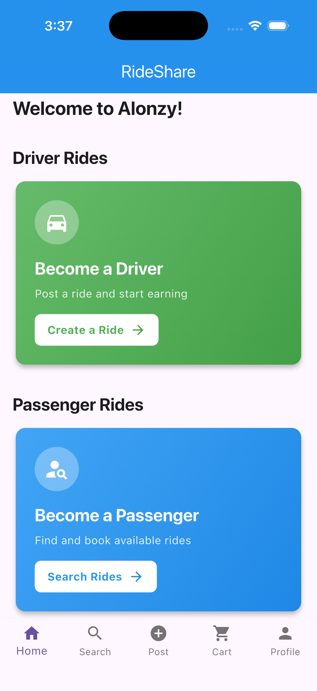
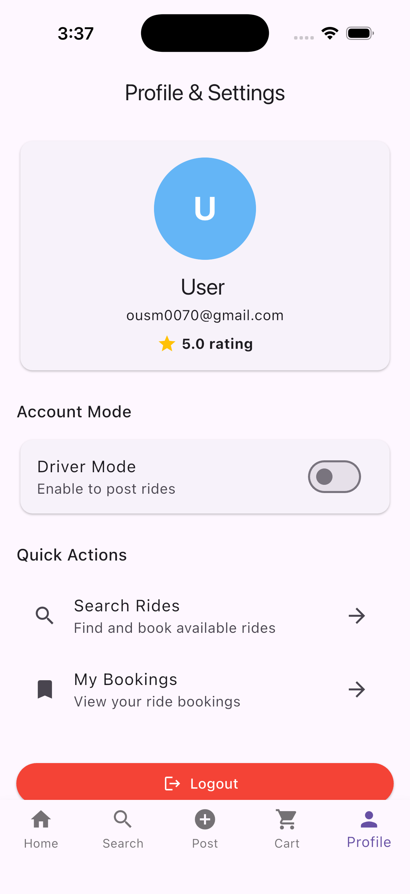

# Supabase Flutter Ride-Sharing App

A modern Flutter application for ride-sharing built with Supabase as the backend. Users can search for available rides, post rides they're offering, manage bookings, and handle driver-specific features all through an intuitive mobile interface.

## 📱 Features

- **User Authentication**: Secure login and signup with Supabase Auth
- **Search Rides**: Find available rides by origin, destination, date, and price
- **Post Rides**: Create and list rides you're offering
- **Manage Bookings**: View and track your ride bookings as a passenger
- **Driver Bookings**: Manage booking requests for rides you've posted
- **User Profiles**: Manage personal profile information and preferences
- **Real-Time Mapping**: MapLibre GL integration for location selection and ride tracking
- **Geolocation**: Automatic location detection and geocoding

## 🛠️ Tech Stack

- **Frontend**: Flutter with Material 3
- **Backend**: Supabase (PostgreSQL + Auth)
- **Maps & Location**:
  - MapLibre GL (v0.20.0) with free OpenFreeMap tiles — no API keys required
  - Geolocator (v9.0.0)
  - Geocoding (Nominatim/OpenStreetMap)
- **State Management**: Stream builders with Supabase real-time subscriptions
- **Dart SDK**: ^3.11.4

## 🗺️ Map Architecture

The map layer is fully decoupled behind a provider-agnostic abstraction so it
can be swapped without touching business logic:

```
lib/maps/
├── map_types.dart        # MapLocation, MapMarkerData, MapPolylineData, MapViewConfig
├── map_controller.dart   # AppMapController — abstract controller interface
├── map_view.dart         # MapView — abstract widget interface
├── app_maps.dart         # AppMaps — global provider registry
└── providers/
    └── maplibre/         # MapLibre implementation (default provider)
```

Screens request maps through `AppMaps.createView(...)` and interact only with
`AppMapController`. To switch to Google Maps later, add a `GoogleMapProvider`
under `providers/` and call `AppMaps.configure(provider)` once at startup.

## 📦 Core Dependencies

- `supabase_flutter: ^2.12.2` - Backend and real-time database
- `maplibre_gl: ^0.20.0` - Map rendering and real-time driver tracking
- `flutter_dotenv: ^5.1.0` - Environment configuration
- `geolocator: ^9.0.0` - GPS and location services

## 🚀 Getting Started

### Prerequisites

- Flutter SDK 3.11.4 or higher
- Dart 3.11.4 or higher
- iOS 11.0+ or Android 5.0+
- A Supabase project account

### Installation

1. **Clone the repository**
   ```bash
   git clone <repository-url>
   cd supabase_flutter_app
   ```

2. **Install dependencies**
   ```bash
   flutter pub get
   ```

3. **Configure Supabase Credentials**
   - The app uses environment variables for secure credential management
   - Update the `.env` file in the project root with your Supabase credentials:
   ```
   SUPABASE_URL=your_supabase_url
   SUPABASE_ANON_KEY=your_supabase_anon_key
   ```
   - **Note**: The `.env` file is in `.gitignore` and will never be committed to version control

4. **Set up iOS**
   ```bash
   cd ios
   pod install
   cd ..
   ```

5. **Configure Maps**
   - MapLibre GL uses the free OpenFreeMap tile service by default and needs
     **no API keys**. Location permissions are already configured in
     `AndroidManifest.xml` and `Info.plist`.
   - To switch providers later, implement a new `MapProvider` in `lib/maps/providers/`.

6. **Run the app**
   ```bash
   flutter run
   ```

## 📁 Project Structure

```
lib/
├── main.dart              # App entry point with authentication
├── theme/                 # Material 3 design system (colors, typography)
├── maps/                  # Decoupled map abstraction (MapLibre by default)
├── screens/               # UI screens
│   ├── login_page.dart
│   ├── signup_page.dart
│   ├── home_page.dart
│   ├── search_rides_page.dart
│   ├── search_map_page.dart
│   ├── post_ride_page.dart
│   ├── my_bookings_page.dart
│   ├── driver_bookings_page.dart
│   ├── profile_page.dart
│   └── location_picker_screen.dart
├── services/              # Business logic
│   ├── auth_service.dart
│   ├── database_service.dart
│   ├── geocoding_service.dart
│   └── map_service.dart
└── widgets/               # Reusable UI components
```

## 🔐 Security Features

### Environment Variables
- Sensitive credentials (Supabase URL and API keys) are stored in `.env` file
- Never hardcoded in source code
- Loaded securely using `flutter_dotenv` at runtime

### Git Configuration
- `.env` file is listed in `.gitignore`
- No credentials will be accidentally pushed to version control
- Recommended: Rotate Supabase keys after initial setup

### Best Practices
- Use Supabase Row-Level Security (RLS) policies for data protection
- Implement proper authentication checks on all API calls
- Validate user inputs before database operations

## 📱 Screenshots

<p align="center">
  
  
</p>

### Key Features Screenshots:
- **Login Screen**: User authentication interface
- **Home Page**: Main navigation hub
- **Search Rides**: Ride discovery with filters
- **Post Ride**: Create new ride listings
- **Bookings**: Manage passenger and driver bookings
- **Profile**: User profile management

## 🔄 Real-Time Features

The app leverages Supabase's real-time capabilities:
- Live ride availability updates
- Instant booking notifications
- Real-time booking status changes
- Live user profile synchronization

## 🗄️ Database Schema

Key tables in Supabase:
- `profiles` - User profile information
- `rides` - Available rides posted by drivers
- `bookings` - Passenger ride bookings
- `ride_routes` - Detailed route information with locations

See `supabase/migrations/001_initial_schema.sql` for complete schema details.

## ⚙️ Configuration

### Supabase Setup
1. Create a Supabase project
2. Set up authentication methods (email/password)
3. Create required database tables
4. Enable Row-Level Security (RLS) policies
5. Generate anon and service role keys

### Environment Variables
```
SUPABASE_URL=https://your-project.supabase.co
SUPABASE_ANON_KEY=your_anonymous_key
```

## 🧪 Testing

Run tests with:
```bash
flutter test
```

## 🚢 Deployment

### iOS
```bash
flutter build ios
```

### Android
```bash
flutter build apk
# or for App Bundle
flutter build appbundle
```

### Web
```bash
flutter build web
```

## 📝 Development Guidelines

- Follow [Dart Style Guide](https://dart.dev/guides/language/effective-dart/style)
- Use meaningful variable and function names
- Add comments for complex logic
- Keep widget files focused and modular
- Use const constructors where applicable

## 🐛 Troubleshooting

### App crashes on startup
- Verify `.env` file exists in project root
- Check Supabase URL and API key validity
- Ensure Flutter is up to date: `flutter upgrade`

### Map not showing
- Verify Google Maps API keys are correctly configured
- Check API is enabled in Google Cloud Console
- Ensure proper permissions are set in platform-specific files

### Location permissions denied
- Check app permissions in device settings
- Ensure `Info.plist` (iOS) and `AndroidManifest.xml` (Android) have location permissions
- Test on physical device (emulator may have issues)

## 🔄 Future Improvements

- [ ] Payment integration
- [ ] In-app messaging between users
- [ ] Ride rating and review system
- [ ] Advanced search filters
- [ ] Offline mode support
- [ ] Push notifications
- [ ] Social media authentication

## 📄 License

This project is licensed under the MIT License.

## 👨‍💻 Contributing

Contributions are welcome! Please feel free to submit a Pull Request.

## 📧 Support

For questions or support, please open an issue in the repository.

---

**Last Updated**: May 1, 2026  
**Version**: 1.0.0
